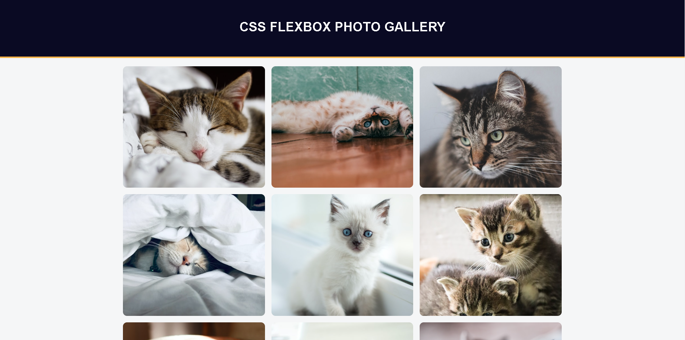

<h1>Flexbox photo gallery</h1>
<h2>A photo gallery of cats made using display flexbox on FreeCodeCamp</h2>

In this course I better understood these concepts:

    <ul>
        <li><b>Align-items</b> positions the flex content along the cross axis, based on the value of the <b>flex-direction</b>, if it’s <b>row</b> your cross axix would be vertical;</li>
        <li><b>Object-fit: cover;</b> property to fill the image container while maintaining it’s aspect ratio;</li>
        <li><b>::after</b> creates a pseudo element which it’s the last child of an element;</li>
    </ul>
<h2>Preview</h2>
    
<h2>Conclusion</h2>
    
In this course I've used some properties that was a little confusing to me when I first started coding. Today I can safely say that I understood.

    
My current goal is to master React, but first I need to complete some begginer courses on FreeCodeCamp.

